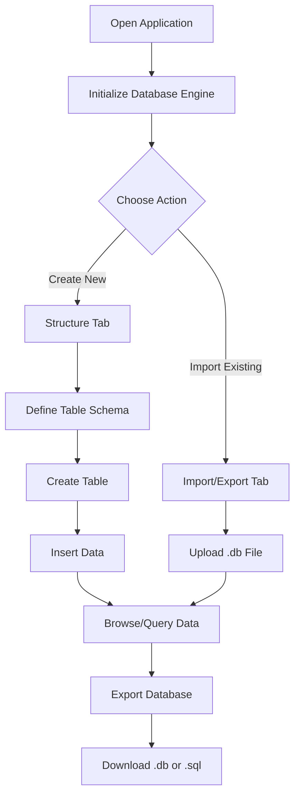
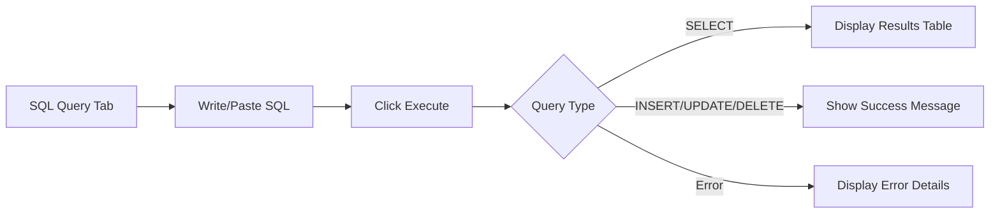
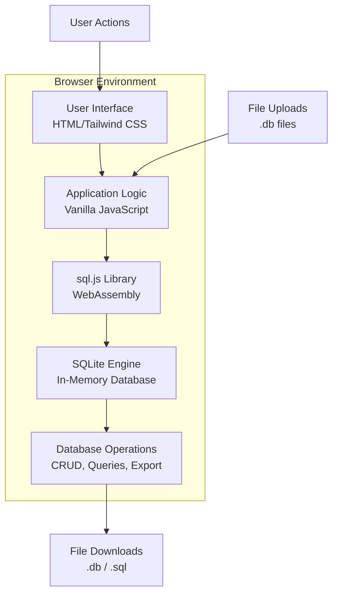

# xsukax SQLite Database Builder

A powerful, privacy-focused, browser-based SQLite database management tool that runs entirely client-side with no server dependencies. Build, manage, and export SQLite databases directly in your web browser with complete data privacy and security.

**Demo:** [https://xsukax.github.io/xsukax-SQLite-Database-Builder](https://xsukax.github.io/xsukax-SQLite-Database-Builder)

## Project Overview

xsukax SQLite Database Builder is a comprehensive web application designed for database developers, students, and professionals who need a quick, secure, and efficient way to create and manage SQLite databases. Built with vanilla JavaScript and powered by sql.js (a WebAssembly port of SQLite), this tool provides a full-featured database management interface without requiring any backend infrastructure or database server installation.

The application offers an intuitive user interface for creating table structures, inserting data, browsing records, executing custom SQL queries, and importing/exporting database files—all within the browser environment. Its zero-installation approach makes it ideal for rapid prototyping, educational purposes, data analysis, and situations where traditional database management tools are unavailable or impractical.

## Security and Privacy Benefits

This application prioritizes user security and data privacy through its architectural design and implementation choices:

- **Complete Client-Side Processing**: All database operations execute entirely within the user's browser using WebAssembly technology. No data is ever transmitted to external servers, ensuring absolute privacy and eliminating network-based security vulnerabilities.

- **Zero Data Collection**: The application does not collect, store, or transmit any user data, analytics, or telemetry. Your database content, queries, and activities remain strictly confidential and never leave your local environment.

- **No Server Dependencies**: Without backend infrastructure, there are no server-side vulnerabilities, database breaches, or unauthorized access risks. Users maintain complete control over their data at all times.

- **Local Storage Only**: Databases exist exclusively in browser memory until explicitly exported by the user. This ephemeral approach prevents unintended data persistence and reduces exposure to browser-based attacks.

- **Open Source Transparency**: The entire codebase is publicly available for audit, ensuring transparency and allowing security researchers to verify the absence of malicious code or hidden data collection mechanisms.

- **SQL Injection Prevention**: User inputs are properly escaped and parameterized in critical operations, reducing the risk of SQL injection vulnerabilities within the client-side environment.

- **No Authentication Required**: The absence of user accounts, login systems, or authentication mechanisms eliminates password-related security concerns and reduces the attack surface.

## Features and Advantages

### Core Features

- **Intuitive Table Creation**: Visual interface for defining table schemas with support for all SQLite data types (TEXT, INTEGER, REAL, BLOB)
- **Advanced Column Constraints**: Configure PRIMARY KEY, AUTOINCREMENT, NOT NULL, UNIQUE, and DEFAULT values through simple checkboxes
- **Data Management**: Insert, browse, and manage records with user-friendly forms and tabular views
- **SQL Query Execution**: Direct SQL query interface with syntax templates for SELECT, INSERT, UPDATE, and DELETE operations
- **Database Import/Export**: 
  - Import existing SQLite database files (.db, .sqlite, .sqlite3)
  - Export databases as binary .db files
  - Export complete SQL scripts for portability and version control
- **Real-Time Statistics**: View table counts, row counts, and database size information
- **Responsive Design**: Mobile-friendly interface built with Tailwind CSS

### Key Advantages

- **Zero Installation**: No software downloads, installations, or system configurations required—just open the browser and start building
- **Cross-Platform Compatibility**: Works on any modern browser (Chrome, Firefox, Safari, Edge) across Windows, macOS, Linux, iOS, and Android
- **Offline Capability**: Once loaded, the application functions without internet connectivity, making it ideal for air-gapped or restricted environments
- **Educational Value**: Perfect for learning SQL and database concepts without the complexity of traditional database server setup
- **Rapid Prototyping**: Quickly design and test database schemas before implementing them in production environments
- **Lightweight**: Single HTML file weighing under 50KB (excluding external libraries) ensures fast loading and minimal resource consumption
- **No Vendor Lock-In**: Export databases to standard SQLite format compatible with virtually all programming languages and platforms

## Installation Instructions

### Web Browser Usage (Recommended)

1. **Online Access**: Navigate to the live demo at [https://xsukax.github.io/xsukax-SQLite-Database-Builder](https://xsukax.github.io/xsukax-SQLite-Database-Builder)

2. **Local Installation**:
   ```bash
   # Clone the repository
   git clone https://github.com/xsukax/xsukax-SQLite-Database-Builder.git
   
   # Navigate to the directory
   cd xsukax-SQLite-Database-Builder
   
   # Open index.html in your browser
   # Option 1: Double-click index.html
   # Option 2: Right-click > Open With > Your Browser
   # Option 3: Drag and drop into browser window
   ```

3. **Hosting on Local Server** (Optional):
   ```bash
   # Using Python 3
   python -m http.server 8000
   
   # Using PHP
   php -S localhost:8000
   
   # Using Node.js (with http-server)
   npx http-server -p 8000
   
   # Then access at: http://localhost:8000
   ```

### System Requirements

- Modern web browser with JavaScript enabled
- WebAssembly support (available in all browsers since 2017)
- Minimum 2GB RAM recommended for large databases
- No backend server or database engine required

## Usage Guide

### Getting Started Workflow



### Step-by-Step Instructions

#### 1. Creating Your First Table

1. Navigate to the **Structure** tab (default view)
2. Enter a table name in the "Table Name" field (e.g., `users`, `products`, `orders`)
3. Click **"+ Add Column"** to add column definitions
4. For each column, specify:
   - **Column Name**: Identifier for the field (e.g., `id`, `username`, `email`)
   - **Data Type**: Select from TEXT, INTEGER, REAL, or BLOB
   - **Default Value**: Optional default value for the column
   - **Constraints**: Check applicable options:
     - **PK**: Primary Key (unique identifier)
     - **NOT NULL**: Require a value
     - **UNIQUE**: Ensure uniqueness across all rows
     - **AI**: Auto-increment (for integer primary keys)
5. Click **"Create Table"** to execute the schema

**Example**: Creating a `users` table with `id` (INT, PK, AI), `username` (TEXT, NOT NULL, UNIQUE), and `email` (TEXT).

#### 2. Inserting Data

1. Switch to the **Insert Data** tab
2. Select your target table from the dropdown menu
3. Fill in the form fields with your data values
4. Click **"Insert Data"** to add the record
5. Repeat for additional records

**Note**: Auto-increment primary key fields are automatically excluded from the insert form.

#### 3. Browsing Data

1. Navigate to the **Browse Data** tab
2. Select a table from the dropdown
3. View all records in a formatted table
4. NULL values are displayed with visual indicators

#### 4. Executing SQL Queries



1. Go to the **SQL Query** tab
2. Enter your SQL query in the textarea (or use template buttons)
3. Click **"Execute Query"** to run the statement
4. View results or success/error messages below

**Example Queries**:
```sql
-- Select all users
SELECT * FROM users;

-- Filter by condition
SELECT username, email FROM users WHERE id > 5;

-- Update records
UPDATE users SET email = 'newemail@example.com' WHERE id = 1;

-- Delete records
DELETE FROM users WHERE username = 'inactive_user';
```

#### 5. Importing Existing Databases

1. Navigate to the **Import/Export** tab
2. Click **"Choose File"** under "Import Database"
3. Select a .db, .sqlite, or .sqlite3 file from your system
4. The database loads immediately with all tables and data intact
5. Use other tabs to view structure and browse data

#### 6. Exporting Your Database

**Option A: Binary Database File**
1. Click **"Download DB"** in the header or Import/Export tab
2. Saves as `xsukax_database.db` (standard SQLite format)
3. Compatible with all SQLite clients and libraries

**Option B: SQL Script**
1. Navigate to **Import/Export** tab
2. Click **"Export SQL Script"**
3. Downloads complete SQL with CREATE TABLE and INSERT statements
4. Ideal for version control, documentation, or migration

### Application Architecture



### Tips for Effective Use

- **Start Simple**: Begin with a single table to familiarize yourself with the interface
- **Use Auto-increment**: Enable AI for integer primary keys to simplify data insertion
- **Test Queries**: Use the SQL Query tab to test complex queries before implementing them in code
- **Regular Exports**: Periodically export your database to avoid data loss (browser memory is volatile)
- **Schema Planning**: Design your table structure carefully—altering tables requires SQL knowledge
- **Browser Console**: Open browser DevTools to monitor for any errors or warnings

## Browser Compatibility

| Browser | Minimum Version | Status |
|---------|----------------|--------|
| Chrome | 57+ | ✅ Fully Supported |
| Firefox | 52+ | ✅ Fully Supported |
| Safari | 11+ | ✅ Fully Supported |
| Edge | 16+ | ✅ Fully Supported |
| Opera | 44+ | ✅ Fully Supported |
| Mobile Browsers | Latest | ✅ Fully Supported |

## Contributing

Contributions are welcome! Please feel free to submit pull requests, report bugs, or suggest features through the GitHub issue tracker.

1. Fork the repository
2. Create your feature branch (`git checkout -b feature/AmazingFeature`)
3. Commit your changes (`git commit -m 'Add some AmazingFeature'`)
4. Push to the branch (`git push origin feature/AmazingFeature`)
5. Open a Pull Request

## License

This project is licensed under the GNU General Public License v3.0.

## Acknowledgments

- Built with [sql.js](https://github.com/sql-js/sql.js) - SQLite compiled to WebAssembly
- Styled with [Tailwind CSS](https://tailwindcss.com/) via CDN
- Inspired by phpMyAdmin and similar database management tools

## Support

If you encounter issues or have questions:
- Open an issue on [GitHub](https://github.com/xsukax/xsukax-SQLite-Database-Builder/issues)
- Check existing issues for solutions
- Review the usage guide above

---

**Made with ❤️ by xsukax** | [GitHub Repository](https://github.com/xsukax/xsukax-SQLite-Database-Builder) | [Live Demo](https://xsukax.github.io/xsukax-SQLite-Database-Builder)
